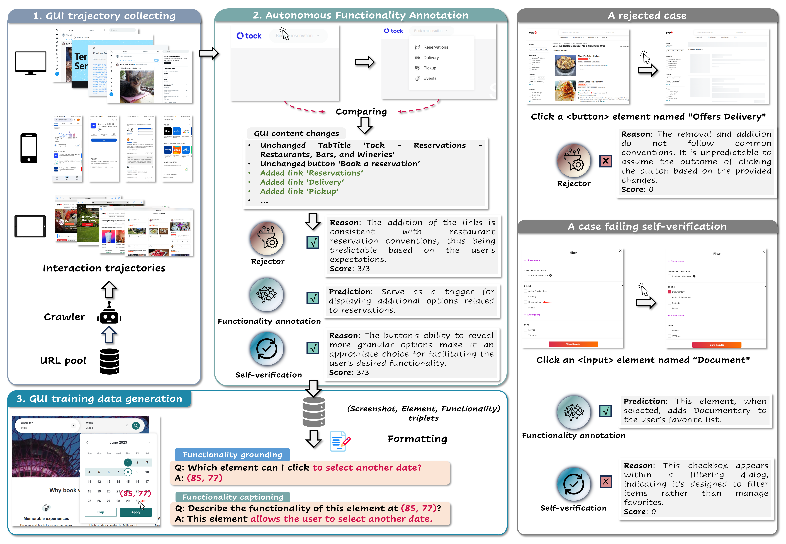
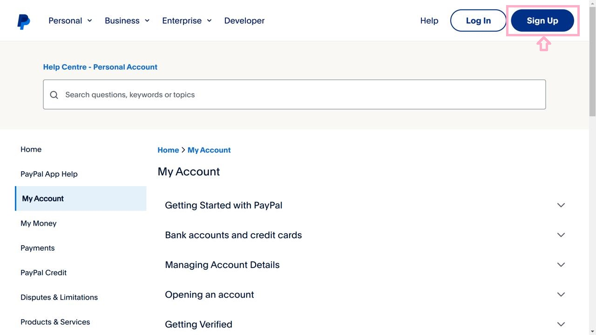

# AutoGUI: Scaling GUI Grounding with Autonomous Functionality Annotations from LLMs

This repo opensource the training and evaluation code for AutoGUI, an automatic and scalable GUI annotation pipeline


***

## AutoGUI pipeline - Revolutionizing Large-Scale GUI Data Annotation
Existing UI annotation methods typically collect data from static UIs, focusing on describing either the visual appearance (e.g., a button beside
30 the navigation bar), element categories (e.g., “menu button”), or brief functions weakly related to the UI context (e.g., “show more information”).

Here, we are thrilled to unveil **AutoGUI**, a groundbreaking and scalable UI annotation pipeline. AutoGUI can autonomously annotate the contextual functionalities of diverse UI elements at scale, entirely eliminating the need for human experts. This innovation not only accelerates the data collection process but also enhances the depth and accuracy of UI functionality descriptions, opening a new path in the field of UI annotation.

<p align="center">

<br>
<b>Illustration of AutoGUI Pipeline</b>
</p>

**AutoGUI** initiates by collecting interaction trajectories on Commom Crawl websites. Each trajectory step captures all interactable elements and the accessibility tree (AXTree) that briefly outlines the UI structure. The content changes in the AXTrees before and after interaction will be used by an opensource LLM (e.g., Llama-3-70B) to predict functionality annotations of the interacted elements.

This annotation process provides rich funtional semantics in the generated annotations, thereby allowing for curating a GUI dataset that can be potentially enhance the GUI understanding capabilities of GUI agents.

## Installation
You can install the AutoGUI package by cloning the repository and running the following command:

```
git clone https://github.com/BraveGroup/AutoGUI
cd AutoGUI
pip install -e .
```

### Additional Packages
Please also follow the installation instructions of [LLaVA](https://github.com/haotian-liu/LLaVA), [vLLM==0.4.0](https://vllm.readthedocs.io) and [SGLang==0.1.14](https://github.com/sgl-project/sglang) to install them for evaluation.

Note that installing these 
## AutoGUI Dataset

### Training Set
We provide 625k functionality grounding/captioning tasks that are generated by populating task templates with the collected element-functionality pairs. To mitigate the gap between various device types, the screenshots are rendered at various resolutions to mimic web browsers and mobile devices.

Please view the training data [here](https://huggingface.co/datasets/WebAgent/AutoGUI-v1). To mitigate the burden of preprocessing Parquet-format data, we also provide a tar-format data file in [here](https://huggingface.co/datasets/WebAgent/AutoGUI-v1-zip).

**A functionality grounding example:**

<p align="center">

</p>

*User*: In this web page image, please locate the element as I describe it (with point). This element triggers a user registration process, allowing new users to create a PayPal account and gain access to the platform's services.

*Assistant*: (91,6)

**A functionality captioning example:**

<p align="center">

</p>

*User*: What happens when you tap position (61,73) on the screen?

*Assistant*: This element serves as an input field for users to provide their birth date, contributing to the registration process by ensuring that users meet the age requirements for creating a Yahoo account.


### **Funcpred** - Functionality Grounding Benchmark
We also curate a 2k split used for evaluating the functionality grounding capabilities of existing vision-language models (VLMs). This split contains 1k samples at web resolution (1280 x 720) and 1k at mobile resolution (428x746).

Download this test split on [*Google Drive*](https://drive.google.com/file/d/1VfhVtcN1B4WSrb4DXJczQQ5zx1_pOvBu/view?usp=sharing).

Each test sample contain: 
* `image`: the GUI screenshot.
* `func`: the functionality annotation of a target element on the screenshot.
* `point`: the center point (X,Y) of the target element. Note that the coordinates are normalized with the range 0-100.
* `unnormalized_box`: the bounding box of the target element in the image coordinate frame.
* `elem_text`: the displayed or alt text of the element.
* `elem_tag`: the HTML tag of the element.
* `device`: the device type of the screenshot.

### Finetuning Code
1. Prepare Data

After downloading [the tar-format data](https://huggingface.co/datasets/WebAgent/AutoGUI-v1-zip), please generate a json file that records all samples with the absolute image paths required by the Qwen-VL model.

For example, the `conversations` field must starts with a user message that looks like `"path/to/autogui_625k/1_web.png</img>\n (instruction)"`

2. Finetuning [Qwen-VL-Chat](https://huggingface.co/Qwen/Qwen-VL-Chat)

Set the `data_path` in `finetune/finetune_autogui_lora.sh` and then run it.


### Evaluation code
Our evalaution code is adapted from lmms-eval. To evaluate a model on a specific UI grounding benchmark, run this command:

```
python3 -m accelerate.commands.launch
    --num_processes=8 \
    -m lmms_eval \
    --model qwen_vl_chat \
    --model_args pretrained="WebAgent/AutoGUI-Qwen-v0.1-LoRA" \
    --tasks funcpred \
    --batch_size 1 \
    --log_samples \
    --log_samples_suffix autogui_funcpred \
    --output_path ./logs/
```

The `pretrained` argument can be tither a LoRA model path that contains only the adapter or a merged model path.

The evaluation tasks used in our paper include: `funcpred`, `screenspot`, `refexp`, `motif`, `vwb`.

The supported models include: `qwen_vl_chat`, `llava_sglang`, `llava_hf`, `deepseek_vl_chat.py`, `cogagent`, `llava_hf`.

## Acknowledgement
Our project codes are based on the [Qwen-VL](https://github.com/QwenLM/Qwen-VL), [SeeClick](https://github.com/njucckevin/SeeClick), and [lmms-eval](https://github.com/EvolvingLMMs-Lab/lmms-eval). We thank the authors for their open-source works.